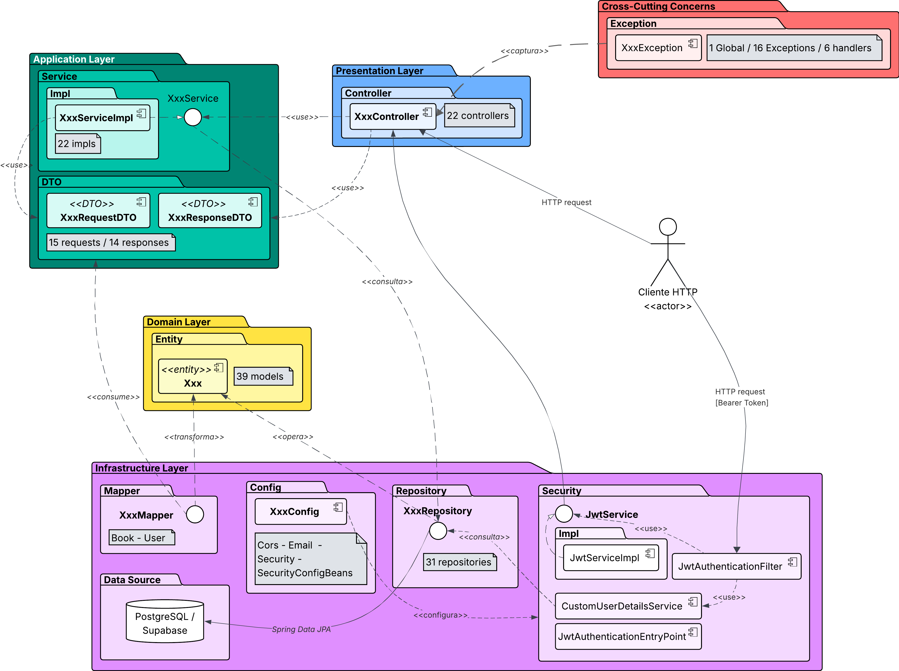

# Lectuaria Backend

Backend REST de **Lectuaria**, plataforma web orientada al fomento de la lectura en la ciudad de Medellín. Implementa autenticación con JWT, gestión de catálogo bibliotecario, red social de lectores, sistema de notificaciones y exposición de la API como recursos HATEOAS.

[](https://sonarcloud.io/summary/new_code?id=Isa-Bedoya-UdeA_backend-reservas)
[](https://sonarcloud.io/summary/new_code?id=Isa-Bedoya-UdeA_backend-reservas)
[](https://sonarcloud.io/summary/new_code?id=Isa-Bedoya-UdeA_backend-reservas)
[](https://sonarcloud.io/summary/new_code?id=Isa-Bedoya-UdeA_backend-reservas)
[](https://sonarcloud.io/summary/new_code?id=Isa-Bedoya-UdeA_backend-reservas)
[](https://sonarcloud.io/summary/new_code?id=Isa-Bedoya-UdeA_backend-reservas)
[](https://sonarcloud.io/summary/new_code?id=Isa-Bedoya-UdeA_backend-reservas)
[](https://sonarcloud.io/summary/new_code?id=Isa-Bedoya-UdeA_backend-reservas)

---

## Tabla de contenidos

1. [Descripción del proyecto](#descripción-del-proyecto)
2. [Stack tecnológico](#stack-tecnológico)
3. [Arquitectura en 5 capas](#arquitectura-en-5-capas)
4. [Variables de entorno requeridas](#variables-de-entorno-requeridas)
5. [Clonación e instalación local](#clonación-e-instalación-local)
6. [Ejecución de la aplicación](#ejecución-de-la-aplicación)
7. [Testing](#testing)
8. [Documentación de la API (Swagger)](#documentación-de-la-api-swagger)
9. [Estructura del proyecto](#estructura-del-proyecto)
10. [Patrones de diseño aplicados](#patrones-de-diseño-aplicados)
11. [HATEOAS](#hateoas)
12. [Decisiones de seguridad](#decisiones-de-seguridad)
13. [Endpoints principales](#endpoints-principales)
14. [CI/CD](#cicd)
15. [Migraciones y base de datos](#migraciones-y-base-de-datos)
16. [Licencia](#licencia)

---

## Descripción del proyecto

Lectuaria es una plataforma social-bibliotecaria que integra en un único ecosistema:

- **Lector:** exploración de catálogo, calificaciones, reseñas, listas de lectura, compartición de libros con amigos, sistema de notificaciones y actividad social.
- **Bibliotecario:** panel de gestión de inventario bibliotecario, carga individual y masiva por CSV, edición de disponibilidad por formato.

El proyecto nace como respuesta al bajo aprovechamiento de la red bibliotecaria de Medellín documentado en el CONPES 3222 de 2003 y el Plan Nacional de Lectura y Bibliotecas.

---

## Stack tecnológico

| Capa | Tecnología | Versión |
|---|---|---|
| Lenguaje | Java | 17 |
| Framework | Spring Boot | 3.5.14 |
| Persistencia | Spring Data JPA / Hibernate | (incluido) |
| Seguridad | Spring Security | (incluido) |
| Autenticación | JJWT | 0.12.5 |
| Mapeo DTO | MapStruct | 1.5.5 |
| Reducción de boilerplate | Lombok | 1.18.36 |
| Validación | Spring Validation (Jakarta Bean Validation) | (incluido) |
| Hipermedia | spring-boot-starter-hateoas | (incluido) |
| Documentación API | springdoc-openapi-starter-webmvc-ui | 2.8.13 |
| Email | Spring Mail (JavaMailSender) + Thymeleaf | (incluido) |
| Almacenamiento de portadas | AWS SDK v2 | 2.25.27 |
| Base de datos | PostgreSQL (gestionada en Supabase) | — |
| Build | Maven | 3.5+ |
| Tests | JUnit 5, Mockito, Spring Boot Test | (incluido) |
| Cobertura | JaCoCo | 0.8.11 |

---

## Arquitectura en 5 capas

La aplicación sigue una arquitectura en capas con responsabilidades claramente delimitadas. La separación facilita el mantenimiento, las pruebas unitarias y la sustitución de implementaciones.

<!-- ============================================================
     ESPACIO RESERVADO PARA EL DIAGRAMA DE ARQUITECTURA EN 5 CAPAS
     ============================================================
     Aqui va la imagen del diagrama. Exportar desde draw.io / Lucidchart
     / Figma en formato PNG a 1200px de ancho y reemplazar esta marca
     por:

         

     Capas a representar (de arriba a abajo en el diagrama):

     ┌─────────────────────────────────────────────────────┐
     │     PRESENTATION LAYER  (controllers)                │
     │     Paquete: com.lectuaria.backend.controller        │
     │     Responde: 98 endpoints REST con HATEOAS         │
     │     Auth: Spring Security + JWT                      │
     └──────────────────────┬──────────────────────────────┘
                            │
     ┌──────────────────────▼──────────────────────────────┐
     │     APPLICATION LAYER  (services + DTOs)            │
     │     Paquetes: com.lectuaria.backend.service         │
     │                com.lectuaria.backend.dto            │
     │     Coordina: lógica de negocio, transacciones,    │
     │               mapeo MapStruct, DTOs                 │
     │     Patrones: Strategy (recomendaciones, filtros),  │
     │               Observer (eventos de dominio)         │
     └──────────────────────┬──────────────────────────────┘
                            │
     ┌──────────────────────▼──────────────────────────────┐
     │     DOMAIN LAYER  (entidades JPA)                   │
     │     Paquete: com.lectuaria.backend.model            │
     │     Entidades: User, Book, ReadingList, Review,    │
     │                Notification, Friendship, etc.       │
     │     No conoce: controllers, repositories externos   │
     └──────────────────────┬──────────────────────────────┘
                            │
     ┌──────────────────────▼──────────────────────────────┐
     │     CROSS-CUTTING CONCERNS  (excepciones)           │
     │     Paquete: com.lectuaria.backend.exception        │
     │     Raíz: DomainException (abstract)                │
     │     Handler único: GlobalExceptionHandler           │
     │     Salida: ErrorResponseDTO estandarizado          │
     └──────────────────────┬──────────────────────────────┘
                            │
     ┌──────────────────────▼──────────────────────────────┐
     │     INFRASTRUCTURE LAYER                             │
     │     Paquetes:                                        │
     │       - com.lectuaria.backend.repository  (JPA)     │
     │       - com.lectuaria.backend.mapper       (MapStruct)
     │       - com.lectuaria.backend.config       (Spring) │
     │       - com.lectuaria.backend.security     (JWT)    │
     │       - com.lectuaria.backend.event        (Observer│
     │         ApplicationEventPublisher + Listeners)      │
     │       - com.lectuaria.backend.util         (helpers)│
     │       - com.lectuaria.backend.specification(queries)│
     │       - src/main/resources/  (properties)          │
     │       - PostgreSQL en Supabase (remoto)             │
     │       - S3-compatible en Supabase Storage           │
     └─────────────────────────────────────────────────────┘
     ============================================================ -->


> **Nota:** la imagen del diagrama debe exportarse como `docs/arquitectura-5-capas.png` desde la herramienta de diseño del equipo (draw.io, Lucidchart, Figma). El bloque de comentarios arriba describe la disposición exacta de las 5 capas.

### Descripción de las capas

| Capa | Paquete | Responsabilidad |
|---|---|---|
| **Presentation Layer** | `com.lectuaria.backend.controller` | Endpoints REST que exponen los recursos como hipermedia HATEOAS (`EntityModel`, `CollectionModel`, `PagedModel`). Validación de entrada y autorización por rol. |
| **Application Layer** | `com.lectuaria.backend.service` y `com.lectuaria.backend.dto` | Lógica de negocio, orquestación de operaciones, transacciones y mapeo entre entidades y DTOs vía MapStruct. Patrones GoF (Strategy, Observer, Factory Method) viven aquí. |
| **Domain Layer** | `com.lectuaria.backend.model` | Entidades JPA que representan el modelo de dominio. No conoce las demás capas. |
| **Cross-cutting Concerns** | `com.lectuaria.backend.exception` | Jerarquía de excepciones de dominio (`DomainException` raíz abstracta), `GlobalExceptionHandler` único y DTO de error estandarizado. |
| **Infrastructure Layer** | `com.lectuaria.backend.repository`, `.mapper`, `.config`, `.security`, `.event`, `.util`, `.specification`, `src/main/resources/` | Repositorios JPA, mappers MapStruct, configuración de Spring, filtros de seguridad JWT, event publisher/listeners, utilidades (HATEOAS, validaciones), specifications (queries dinámicas), archivos de propiedades, integración con PostgreSQL (Supabase) y S3 (Supabase Storage). |

---

## Variables de entorno requeridas

El proyecto carga sus credenciales desde variables de entorno. **No incluir valores reales en el repositorio.** El archivo `.env.example` lista todas las variables requeridas con un placeholder; el archivo `.env` (ignorado por git) debe contener los valores reales y se carga automáticamente al ejecutar la aplicación.

### Base de datos (Supabase PostgreSQL)

| Variable | Descripción | Ejemplo de uso |
|---|---|---|
| `DB_URL` | JDBC URL completa de la base de datos PostgreSQL (connection pooler de Supabase). | `jdbc:postgresql://...` |
| `DB_USER` | Usuario de la base de datos. | usuario provisto por Supabase |
| `DB_PASSWORD` | Contraseña del usuario de base de datos. | secreto |

### JWT

| Variable | Descripción | Ejemplo de uso |
|---|---|---|
| `JWT_SECRET` | Clave secreta (Base64) para firmar los tokens JWT. Debe ser de al menos 256 bits. | cadena aleatoria codificada en Base64 |
| `JWT_ACCESS_EXPIRATION` | Tiempo de vida del access token en milisegundos. | `3600000` (1 hora) |
| `JWT_REFRESH_EXPIRATION` | Tiempo de vida del refresh token en milisegundos. | `604800000` (7 días) |

### Almacenamiento de portadas (Supabase Storage S3-compatible)

| Variable | Descripción | Ejemplo de uso |
|---|---|---|
| `AWS_S3_ENDPOINT` | Endpoint del bucket S3-compatible. | `https://<id>.supabase.co/storage/v1/s3` |
| `AWS_REGION` | Región del bucket. | `us-east-1` |
| `AWS_S3_BUCKET` | Nombre del bucket donde se almacenan las portadas. | nombre del bucket |
| `AWS_ACCESS_KEY_ID` | Access key del servicio. | secreto |
| `AWS_SECRET_ACCESS_KEY` | Secret key del servicio. | secreto |

### Frontend y email

| Variable | Descripción | Ejemplo de uso |
|---|---|---|
| `FRONTEND_URL` | URL del frontend (para construir enlaces de reset de contraseña). | `http://localhost:5173` en dev |
| `EMAIL_USERNAME` | Usuario SMTP. | dirección de Gmail |
| `EMAIL_PASSWORD` | Contraseña SMTP (recomendado: app password de Gmail). | secreto |

> **Importante:** ningún valor real se incluye en este README ni en el repositorio. La lista anterior solo documenta los **nombres** de las variables requeridas y el **propósito** de cada una. Los valores deben vivir exclusivamente en `.env` (que está en `.gitignore`) o en los secrets del proveedor de despliegue.

---

## Clonación e instalación local

```bash
# 1. Clonar el repositorio
git clone https://github.com/Isa-Bedoya-UdeA/Lectuaria-backend.git
cd Lectuaria-backend

# 2. Crear el archivo de variables de entorno a partir del ejemplo
cp .env.example .env

# 3. Editar .env con los valores locales
#    (ver la sección "Variables de entorno requeridas" arriba para la lista completa)

# 4. Compilar el proyecto (descarga dependencias en la primera ejecución)
mvn clean install -DskipTests
```

### Requisitos
- **JDK 17+** (Temurin recomendado)
- **Maven 3.5+**
- **PostgreSQL 14+** corriendo localmente o acceso a una instancia Supabase

---

## Ejecución de la aplicación

```bash
# Compilar y correr con el perfil dev (default)
mvn spring-boot:run

# O explícitamente
mvn spring-boot:run -Dspring-boot.run.profiles=dev

# Empaquetar y correr el JAR
mvn clean package -DskipTests
java -jar target/lectuaria-backend.jar
```

El servidor queda disponible en `http://localhost:3000`.

### Perfiles disponibles

| Perfil | Descripción |
|---|---|
| `dev` | Desarrollo local contra PostgreSQL (Supabase o local). Activo por defecto. |
| `test` | Ejecución de tests. Usa H2 en memoria. |
| `prod` | Producción. Configuración segura (sin DEBUG ni SHOW_SQL). |

---

## Testing

```bash
# Ejecutar todos los tests
mvn test

# Ejecutar una clase específica
mvn test -Dtest=BookControllerTest

# Generar reporte de cobertura con JaCoCo
mvn clean test jacoco:report
# Reporte en: target/site/jacoco/index.html
```

El proyecto cuenta con **396 tests** (254 unitarios + 151 de integración) que cubren:
- Capa de servicios (Book, Auth, Notification, User, Library, Friendship, etc.)
- Capa de controllers con MockMvc
- Validación de seguridad JWT y autorización por rol
- Respuestas HATEOAS (`EntityModel`, `CollectionModel`, `PagedModel`)

---

## Documentación de la API (Swagger)

La API está documentada con **OpenAPI 3 / Swagger** mediante `springdoc-openapi`.

Con la aplicación corriendo, accedé a:

- **Swagger UI:** `http://localhost:3000/swagger-ui.html`
- **OpenAPI JSON:** `http://localhost:3000/v3/api-docs`

La documentación se genera automáticamente a partir de los controllers y DTOs; incluye metadatos del proyecto (título, versión, contacto, servidores) configurados en `OpenApiConfig`.

---

## Estructura del proyecto

```
lectuaria-backend/
├── docs/
│   ├── arquitectura-5-capas.png           # Diagrama de arquitectura
│   └── sprint-*.md
├── src/
│   ├── main/
│   │   ├── java/com/lectuaria/backend/
│   │   │   ├── LectuariaBackendApplication.java
│   │   │   ├── config/                    # Configuration Layer (Spring, OpenAPI, Security, CORS, Email)
│   │   │   │   ├── OpenApiConfig.java
│   │   │   │   ├── SecurityConfig.java
│   │   │   │   ├── SecurityConfigBeans.java
│   │   │   │   ├── EmailConfig.java
│   │   │   │   └── CorsConfig.java
│   │   │   ├── controller/                # Presentation Layer
│   │   │   │   ├── auth/                  # AuthController, PasswordResetController
│   │   │   │   ├── book/                  # PlatformController
│   │   │   │   ├── books/                 # BookController, BookPublishController, BookRatingController,
│   │   │   │   │                          # BookShareController, AuthorController, GenreController
│   │   │   │   ├── friendship/            # FriendshipController
│   │   │   │   ├── home/                  # HomeController
│   │   │   │   ├── library/               # LibraryController, LibraryBookController
│   │   │   │   ├── list/                  # UserListController
│   │   │   │   ├── notification/          # NotificationController, NotificationPreferenceController
│   │   │   │   ├── shared/                # SharedWithMeController
│   │   │   │   ├── user/                  # UserProfileController, UserPrivacySettingsController
│   │   │   │   ├── zones/                 # ZoneController
│   │   │   │   └── HealthController.java
│   │   │   ├── service/                   # Application Layer (lógica de negocio)
│   │   │   │   ├── auth/
│   │   │   │   ├── book/                  # BookServiceImpl, BookShareServiceImpl, BookPublishServiceImpl, etc.
│   │   │   │   │                          # + book/search/   (Strategy filters)
│   │   │   │   │                          # + book/externalApi/ (OpenLibrary, GoogleBooks)
│   │   │   │   ├── friendship/
│   │   │   │   ├── home/                  # + home/recommendation/ (Strategy recomendaciones)
│   │   │   │   ├── library/
│   │   │   │   ├── list/
│   │   │   │   ├── notification/
│   │   │   │   ├── shared/
│   │   │   │   ├── storage/               # S3StorageService
│   │   │   │   └── user/
│   │   │   ├── dto/                       # DTOs de entrada y salida
│   │   │   │   ├── auth/
│   │   │   │   ├── book/
│   │   │   │   ├── common/
│   │   │   │   ├── home/
│   │   │   │   ├── library/
│   │   │   │   ├── list/
│   │   │   │   ├── notification/
│   │   │   │   ├── recommendation/
│   │   │   │   ├── shared/
│   │   │   │   ├── statistics/
│   │   │   │   └── user/
│   │   │   ├── model/                     # Domain Layer (entidades JPA)
│   │   │   ├── repository/                # Repositorios JPA
│   │   │   ├── mapper/                    # MapStruct mappers
│   │   │   ├── security/                  # Filtros JWT, UserDetailsService, AuthenticatedUserResolver
│   │   │   ├── exception/                 # Jerarquía de excepciones + handlers
│   │   │   ├── event/                     # Eventos del Observer Pattern (GoF)
│   │   │   ├── scheduled/                 # Tareas programadas
│   │   │   ├── specification/             # Specifications JPA (queries dinámicas)
│   │   │   ├── util/                      # Utilidades (HateoasLinkBuilder, BookResponseFactory, etc.)
│   │   │   └── validation/                # Validadores custom
│   │   └── resources/
│   │       ├── application.properties
│   │       ├── application-dev.properties
│   │       ├── application-test.properties
│   │       ├── application-prod.properties
│   │       └── templates/
│   │           └── password-reset.html
│   └── test/
│       └── java/com/lectuaria/backend/
│           ├── controller/                # Tests de capa web (MockMvc)
│           └── service/                   # Tests unitarios de servicios
├── .env.example                           # Plantilla de variables de entorno (sin valores)
├── .gitignore
├── Dockerfile
├── pom.xml
└── README.md
```

---

## Patrones de diseño aplicados

| Patrón (GoF) | Aplicación | Archivos clave |
|---|---|---|
| **Builder** | Construcción de DTOs y entidades vía Lombok `@Builder`. | Todas las entities y DTOs. |
| **Factory Method** | `BookResponseFactory` centraliza la creación del `EntityModel<BookDetailDTO>` con todas las relaciones hipermedia. | `util/BookResponseFactory.java`, aplicado en `BookController.getBookById`. |
| **Observer** | Publicación de `BookSharedEvent` cuando un usuario comparte un libro; `BookSharedNotificationListener` reacciona creando la notificación. Desacopla el servicio de compartición del servicio de notificaciones. | `event/BookSharedEvent.java`, `event/BookSharedNotificationListener.java`, `service/book/impl/BookShareServiceImpl.java`. |
| **Strategy** (recomendaciones) | Cadena de algoritmos de recomendación inyectados como `List<RecommendationStrategy>`, ordenados por `@Order`. Permite añadir nuevas estrategias (trending, amigos leyeron) sin tocar el orquestador. | `service/home/recommendation/RecommendationStrategy.java` + `PreferenceBasedRecommendationStrategy` + `HighRatedRecommendationStrategy` + `HomeServiceImpl`. |
| **Strategy** (filtros de búsqueda) | Filtros componibles de búsqueda de libros (rating, años, formato) inyectados como `List<BookFilterStrategy>`. El orquestador `composeFilterSpecifications` en `BookServiceImpl` encadena las strategies relevantes. | `service/book/search/BookFilterStrategy.java` + `MinRatingFilterStrategy` + `MinYearFilterStrategy` + `MaxYearFilterStrategy` + `FormatFilterStrategy`. |

### Jerarquía de excepciones

```
DomainException (abstract)
├── BusinessException              (HTTP 400)
│   └── ConflictException          (HTTP 409)
├── ResourceNotFoundException      (HTTP 404)
├── UnauthorizedException          (HTTP 401)
│   ├── TokenException             (HTTP 401)
│   └── InvalidCredentialsException (HTTP 401)
├── ForbiddenException             (HTTP 403)
└── ValidationException            (HTTP 400)
```

Cada excepción expone su `HttpStatus` y un `code` estable para el cliente. El `GlobalExceptionHandler` único mapea el árbol completo a un `ErrorResponseDTO` estandarizado con `message`, `errors[]`, `code`, `traceId` y `timestamp`.

---

## HATEOAS

La API expone sus recursos como **hipermedia HATEOAS** mediante `spring-boot-starter-hateoas`. Cada endpoint que devuelve un recurso lo envuelve en `EntityModel<T>`, `CollectionModel<T>` o `PagedModel<EntityModel<T>>` con sus `_links` correspondientes.

### Estructura de respuesta típica

```json
{
  "content": [ { "id": 1, "title": "...", "_links": { "self": { "href": "..." } } } ],
  "page": { "size": 20, "number": 0, "totalElements": 142, "totalPages": 8 },
  "_links": {
    "self": { "href": "/api/books?page=0&size=20" },
    "next": { "href": "/api/books?page=1&size=20" },
    "prev": { "href": "/api/books?page=-1&size=20" },
    "first": { "href": "/api/books?page=0&size=20" },
    "last": { "href": "/api/books?page=7&size=20" }
  }
}
```

### Cobertura

- **98 endpoints** con recursos HATEOAS (todos los aplicables).
- Las únicas excepciones legítimas son: auth (login, register, refresh por tokens en cookie/header), health checks, descargas binarias (CSV template), y endpoints `void` (204 No Content).

### Helper central

`HateoasLinkBuilder` (`util/HateoasLinkBuilder.java`) centraliza la creación de los links hipermedia. `BookResponseFactory` (`util/BookResponseFactory.java`) implementa el patrón Factory Method para construir el `EntityModel` del detalle de libro con todos sus links relacionados (self, similar, share-link).

---

## Decisiones de seguridad

- **Autenticación:** JWT con access token de corta duración (header `Authorization: Bearer <token>`) + refresh token en cookie `httpOnly`, `SameSite=Lax`.
- **Hash de contraseñas:** BCrypt con sal automática.
- **Lockout de cuenta:** 5 intentos fallidos → bloqueo de 15 minutos (entidad `User`).
- **Autorización por rol:** tres roles `READER`, `LIBRARIAN`, `ADMIN`. Reglas en `SecurityConfig.java` con `@RequestMatchers` por método HTTP y patrón de URL.
- **CORS:** configuración explícita en `CorsConfig.java`.
- **CSRF:** deshabilitado en API stateless (JWT).
- **CSRF tokens en cookies:** `httpOnly=true`, `secure=true`, `sameSite=Strict`.
- **Envío de emails:** SMTP con STARTTLS obligatorio.
- **Almacenamiento de imágenes:** S3-compatible (Supabase Storage) con credenciales IAM dedicadas.
- **Producción:** `application-prod.properties` configura `ddl-auto=validate`, `show-sql=false`, `format_sql=false` y logging en nivel INFO (nunca DEBUG/TRACE) para evitar fuga de SQL con valores.

### Reglas clave de `SecurityConfig`
- `GET /api/health/**` — público
- `GET /api/auth/**`, `POST /api/auth/**` — público
- `GET /api/libraries`, `GET /api/genres`, `GET /api/books/...` — público (catálogo navegable sin login)
- `GET /api/users/{slug}` — público (con info enriquecida si está autenticado)
- `GET /api/libraries/me/statistics` — solo `LIBRARIAN` o `ADMIN`
- Cualquier otro endpoint — requiere autenticación JWT

---

## Endpoints principales

| Método | Path | Descripción | Auth |
|---|---|---|---|
| POST | `/api/auth/register` | Registro de usuario | No |
| POST | `/api/auth/login` | Login (devuelve access + refresh token en cookie) | No |
| POST | `/api/auth/logout` | Cierre de sesión (invalida refresh) | Sí |
| GET | `/api/auth/me` | Perfil del usuario autenticado | Sí |
| GET | `/api/books` | Listar libros con paginación y filtros | No |
| GET | `/api/books/{id}` | Detalle de libro | No |
| GET | `/api/books/isbn/{isbn}` | Detalle por ISBN | No |
| GET | `/api/books/popular` | Libros más leídos del mes | No |
| GET | `/api/books/top-rated` | Libros mejor calificados | No |
| GET | `/api/books/new-catalog` | Catálogo de libros nuevos | No |
| GET | `/api/books/featured` | Secciones destacadas (home) | No |
| POST | `/api/books/{id}/share` | Compartir libro con amigos | Sí |
| GET | `/api/lists` | Listas del usuario autenticado | Sí |
| POST | `/api/lists` | Crear lista personalizada | Sí |
| GET | `/api/libraries` | Listar bibliotecas | No |
| GET | `/api/libraries/me/statistics` | Estadísticas de la biblioteca propia | Sí (bibliotecario) |
| GET | `/api/friendships` | Lista de amigos | Sí |
| POST | `/api/friendships/requests/{receiverId}` | Enviar solicitud de amistad | Sí |
| GET | `/api/notifications` | Notificaciones del usuario | Sí |
| GET | `/api/health` | Estado del servicio | No |
| GET | `/api/health/db` | Estado de la base de datos | No |

**Recursos HATEOAS:** todos los endpoints (excepto auth/health/CSV-template/binary) responden con `EntityModel<T>`, `CollectionModel<T>` o `PagedModel<EntityModel<T>>`, incluyendo `_links` con relaciones relevantes.

---

## CI/CD

El proyecto usa **GitHub Actions** con tres jobs:

1. **Tests:** ejecuta `mvn clean test jacoco:report` con JDK 17.
2. **SonarCloud:** análisis estático de calidad y cobertura.
3. **Build:** compila el JAR y publica la imagen Docker en Docker Hub.

Workflow en `.github/workflows/build.yml`. Activación en cada push a `main` o manual vía `workflow_dispatch`.

---

## Migraciones y base de datos

- **Motor:** PostgreSQL 14+ (gestionado en Supabase, en producción).
- **Estrategia:** JPA + Hibernate con `ddl-auto=validate` (nunca `update` en desarrollo para evitar drift).
- **Migraciones SQL:** se mantienen en una carpeta aparte del proyecto backend (ver repositorio de migraciones o carpeta `db/` en el monorepo). El backend asume que la base de datos ya está provisionada con el esquema correcto antes del primer arranque.
- **Pool de conexiones:** HikariCP con `maximum-pool-size=3` (límite del plan gratuito de Supabase) y `connection-timeout=15s`.

---

## Licencia

Proyecto de uso académico. Universidad de Antioquia, Facultad de Ingeniería, 2026-1.
